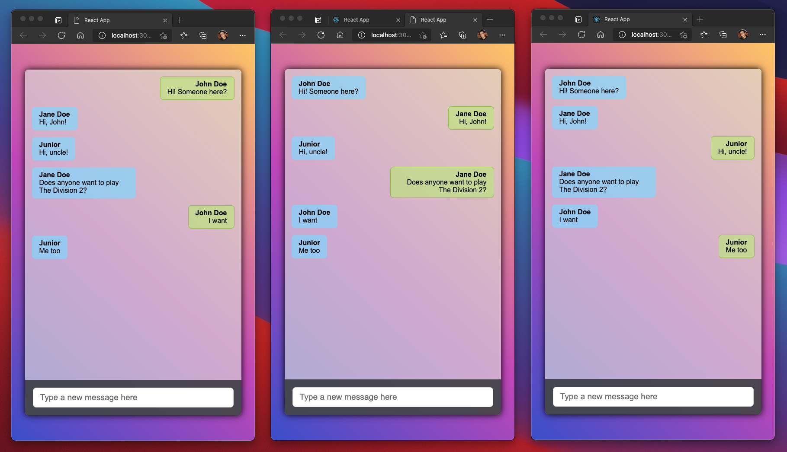
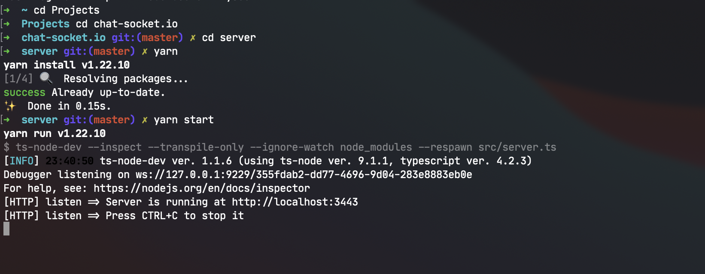
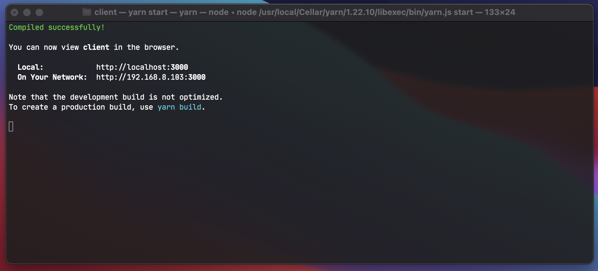
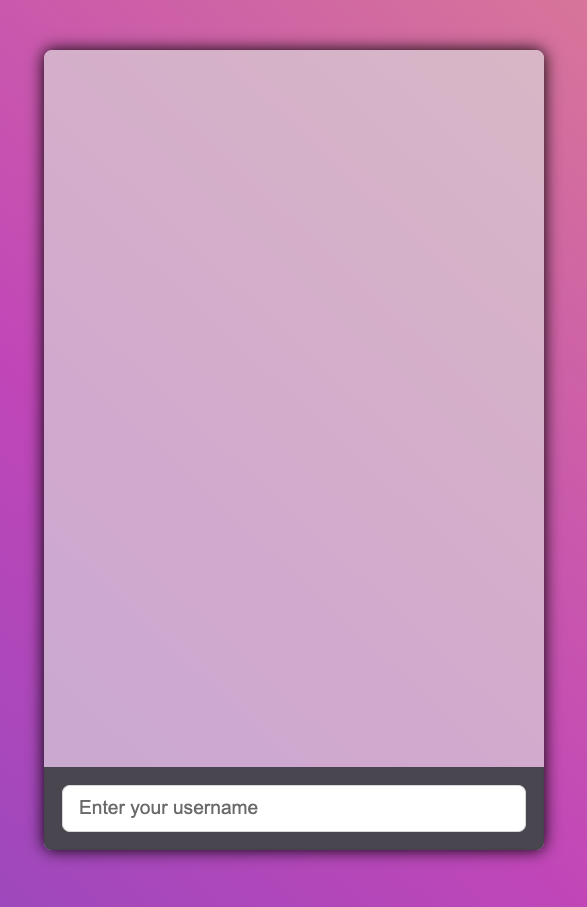

# Simple Real-Time Chat with socket.io 

<div align="center">
    
</div>


<p align="center">
  <a href="https://rocketseat.com.br">
    
  </a>
  
</p>

<p align="center">
  <a href="#about-project">About this project</a>&nbsp;&nbsp;&nbsp;|&nbsp;&nbsp;&nbsp;
  <a href="#instructions-for-running-the-project">Instructions for running the project</a>&nbsp;&nbsp;&nbsp;|&nbsp;&nbsp;&nbsp;
  <a href="#memo-licença">Licença</a>
</p>

## About this project

I created this project to get to know Socket.io. Is a simple chat in real-time.

### Technologies used

#### Client-side

- React
- Typescript
- Socket.io-client
- Sass

#### Server-side

- Typescript
- Express
- Socket.io

## Instructions for running the project

- Clone the Repository

```batch
https://github.com/Sebenta/chat-socket.io.git
```

ou

```batch
git@github.com:Sebenta/chat-socket.io.git
```

### Run Server

```batch
cd server

yarn

yarn start
```

#### Result

You should get something like this

<div align="center">
    
</div>

### Client

```batch
cd client

yarn

yarn start
```

#### Result

You should get something like this

<div align="center">
    
    
</div>

## :memo: Licence

This project uses the MIT [License](https://github.com/git/git-scm.com/blob/master/MIT-LICENSE.txt)

---

Created with 💜 by <a href="https://www.linkedin.com/in/eduardoqueiros/">Eduardo Queirós</a> :wave:
